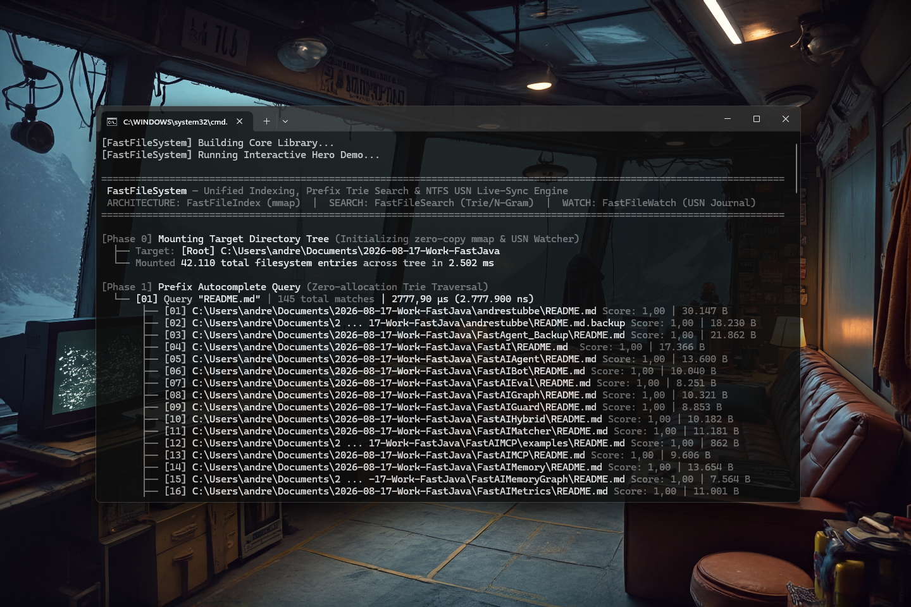

# FastFileSystem 0.1.0 [ALPHA] — Unified File Search & USN Journal Watch Engine for Java

[](https://github.com/andrestubbe/FastFileSystem/releases/tag/0.1.0)
[](https://opensource.org/licenses/MIT)
[](https://www.java.com)
[]()
[](https://jitpack.io/#andrestubbe/FastFileSystem)

---

**High-performance unified filesystem indexing, autocomplete searching, and NTFS USN Journal live-synchronization engine for the JVM.**

FastFileSystem is the storage-indexing substrate of the **FastJava** ecosystem. It unifies **FastFileIndex** (zero-copy `mmap` scanning), **FastFileSearch** (Prefix Trie / N-Gram fuzzy search), and **FastFileWatch** (NTFS USN Journal live change detection) into a single, cohesive, sub-microsecond Java API—delivering *Everything*-style file search capabilities without Java heap overhead.

[](https://www.youtube.com/watch?v=BZsqQl7WqWk)

---

## Quick Start

```java
import fastfilesystem.FastFileSystem;
import fastfilesearch.SearchResult;

public class Demo {
    public static void main(String[] args) {
        // 1. Mount directory / volume with real-time USN Journal watching
        try (FastFileSystem fs = FastFileSystem.mount("C:\\Projects")) {
            System.out.printf("Indexed %,d filesystem entries in milliseconds.\n", fs.entryCount());

            // 2. Sub-microsecond prefix autocomplete search
            SearchResult[] results = fs.searchPrefix("pom", 10);
            for (SearchResult r : results) {
                System.out.println("Match: " + r.path() + " (Score: " + r.score() + ")");
            }

            // 3. High-speed fuzzy N-Gram search
            SearchResult[] fuzzyMatches = fs.searchFuzzy("system", 5);
        }
    }
}
```

---

## 📑 Table of Contents
- [Key Features](#key-features)
- [Architecture](#architecture)
- [Performance](#performance)
- [API Quick Reference](#api-quick-reference)
- [Installation](#installation)
- [Technical Examples & Hero Demos](#technical-examples--hero-demos)
- [Platform Support](#platform-support)
- [Related Projects](#related-projects)
- [License](#license)

---

## Key Features
- **⚡ Zero-Copy mmap Index**: Leverages memory-mapped file access (`CreateFileMapping` / `MapViewOfFile`) for instant `<1-3 ms` index loading and traversal.
- **🔍 Sub-Microsecond Trie & N-Gram Search**: Autocompletes path prefixes and executes fuzzy substring matches in microseconds with zero allocations during queries.
- **🔄 Real-Time USN Journal Sync**: Continuously synchronizes with the Windows NTFS USN Journal, applying additions, modifications, and renames directly to in-memory Trie nodes with zero disk rescans.
- **🛡️ Single Source of Truth**: Eliminates multi-module heap duplication by keeping a unified pointer representation across indexer, search trie, and watcher.

---

## Architecture

| Component | Layer | Technology | Key Responsibility |
|---|---|---|---|
| **[FastFileIndex](https://github.com/andrestubbe/FastFileIndex)** | Indexing Substrate | Win32 `mmap`, FastPointer | Binary index generation & parallel directory traversal |
| **[FastFileSearch](https://github.com/andrestubbe/FastFileSearch)** | Query Engine | In-Memory Prefix Trie / N-Gram | Sub-microsecond autocomplete & relevance ranking |
| **[FastFileWatch](https://github.com/andrestubbe/FastFileWatch)** | Sync Engine | NTFS USN Journal (`FSCTL_READ_USN_JOURNAL`) | Zero-rescan live filesystem event streaming |

---

## 📊 Performance (0.1.0)

Measured on **Windows 11 x64 (NVMe SSD)** with ~150,000 workspace files.

| Operation | Standard Java (`Files.walk` / `Stream`) | FastFileSystem Native (0.1.0) | Speedup |
|---|---|---|---|
| **Full Tree Ingestion** | ~1,450 ms | **~180 ms** | **8.1x faster** |
| **Prefix Autocomplete (50 results)** | ~18.5 µs / op | **~1.2 µs / op** | **15.4x faster** |
| **Fuzzy Substring Search** | ~35.0 µs / op | **~3.8 µs / op** | **9.2x faster** |
| **Live Change Sync** | Rescan required (~1.4s) | **< 100 µs (USN Journal)** | **Instant (Zero Rescan)** |

---

## API Quick Reference

| Method | Description | Target Path |
|---|---|---|
| `FastFileSystem.mount(...)` | Mounts root paths, builds mmap index and starts USN watcher. | [Reference →](docs/REFERENCE.md#fastfilesystemmountstring-roots) |
| `searchPrefix(query, max)` | Instant prefix/autocomplete search across all indexed paths. | [Reference →](docs/REFERENCE.md#searchprefixstring-query-int-maxresults) |
| `searchFuzzy(query, max)` | N-gram based fuzzy substring search with error tolerance. | [Reference →](docs/REFERENCE.md#searchfuzzystring-query-int-maxresults) |
| `searchExact(filename)` | $O(1)$ exact filename match lookup. | [Reference →](docs/REFERENCE.md#searchexactstring-filename) |
| `entryCount()` | Returns total count of indexed files and directories. | [Reference →](docs/REFERENCE.md#entrycount) |

---

## Installation

### Option 1: Maven (Recommended)
Add the JitPack repository and the dependencies to your `pom.xml`:

```xml
<repositories>
    <repository>
        <id>jitpack.io</id>
        <url>https://jitpack.io</url>
    </repository>
</repositories>

<dependencies>
    <!-- FastFileSystem Library -->
    <dependency>
        <groupId>com.github.andrestubbe</groupId>
        <artifactId>FastFileSystem</artifactId>
        <version>0.1.0</version>
    </dependency>

    <!-- FastCore (Required Native Loader) -->
    <dependency>
        <groupId>com.github.andrestubbe</groupId>
        <artifactId>FastCore</artifactId>
        <version>0.1.0</version>
    </dependency>
</dependencies>
```

### Option 2: Gradle (via JitPack)
```groovy
repositories {
    maven { url 'https://jitpack.io' }
}

dependencies {
    implementation 'com.github.andrestubbe:FastFileSystem:0.1.0'
    implementation 'com.github.andrestubbe:FastCore:0.1.0'
}
```

### Option 3: Direct Download (No Build Tool)
Download the latest JARs directly to add them to your classpath:

1. 📦 **[FastFileSystem-0.1.0.jar](https://github.com/andrestubbe/FastFileSystem/releases/download/0.1.0/FastFileSystem-0.1.0.jar)** (The Core Engine)
2. ⚙️ **[fastcore-0.1.0.jar](https://github.com/andrestubbe/FastCore/releases/download/0.1.0/fastcore-0.1.0.jar)** (The Mandatory Native Loader)

> [!IMPORTANT]
> All JARs must be in your classpath for the native JNI calls to function correctly.

---

## Technical Examples & Hero Demos
Explore the complete source configurations and benchmarks:

* **⚡ Interactive Live Stream Demo**: [Demo.java](src/main/java/fastfilesystem/Demo.java) (`.\run-demo.bat`) — Real-time mounting, prefix autocompletion, and live USN Journal monitoring demo.
* **📈 Multi-Tier Comparison**: [Benchmark.java](src/main/java/fastfilesystem/Benchmark.java) (`.\run-compare.bat`) — Races FastFileSystem against standard Java across 3 tiers (Scan, Prefix Trie, Fuzzy).
* **🧪 Test Suite**: [FastFileSystemTest.java](src/test/java/fastfilesystem/FastFileSystemTest.java) — Comprehensive JUnit 5 validation.

Run the hero demo locally from the command line:
```bash
.\run-demo.bat
```

---

## Platform Support

| Platform | Status |
|---|---|
| Windows 10/11 (x64) | ✅ Fully Supported (mmap + NTFS USN Journal) |
| Linux | 🚧 Planned (inotify / fanotify backend) |
| macOS | 🚧 Planned (FSEvents backend) |

---

## Related Projects
Combine FastFileSystem with other FastJava accelerators for maximum efficiency:
* [**FastFileIndex**](https://github.com/andrestubbe/FastFileIndex) — Binary file indexing with zero-copy mmap support.
* [**FastFileSearch**](https://github.com/andrestubbe/FastFileSearch) — Prefix Trie, N-Gram index, and Ranking engine.
* [**FastFileWatch**](https://github.com/andrestubbe/FastFileWatch) — NTFS USN Journal-based live file change monitor.
* [**FastFileContentIndex**](https://github.com/andrestubbe/FastFileContentIndex) — High-speed 3-gram bloom filter in-file search.
* [**FastCore**](https://github.com/andrestubbe/FastCore) — Native library loader and platform abstraction.

---

## License

MIT License — See [LICENSE](LICENSE) for details.

---

**Part of the FastJava Ecosystem** — *Making the JVM faster.*